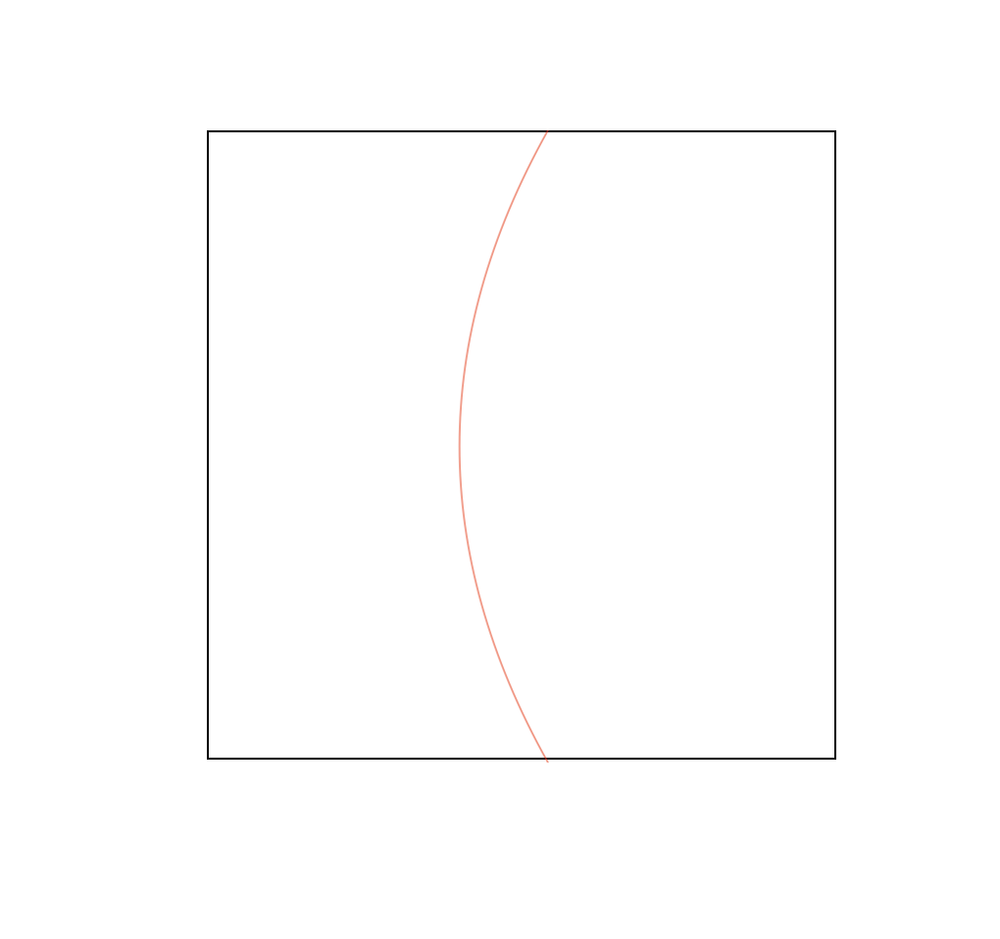
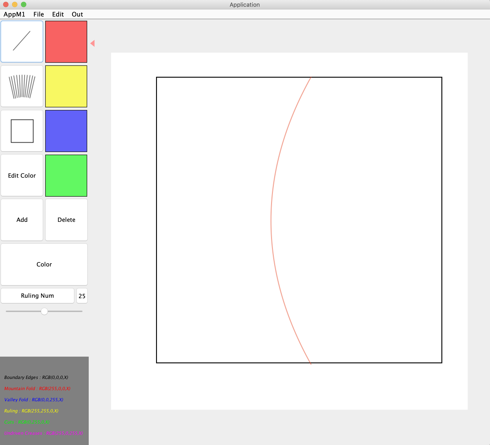
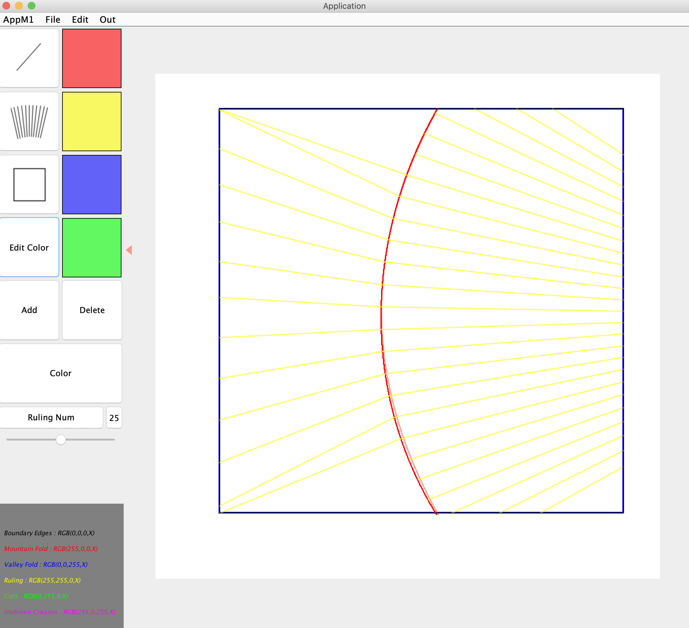

# MyAppForOrigamiSimulator
This is an application to make svg files for Origami Simulator.

# Origami Simulator
Origami Simulator[Amanda Ghassaei 2017] is a simulator for Origami.
Inputting developments of Origami(.FOLD or .svg), we can get three dimensional shape models and its process animation made from it by bending creases.
Using this simulator, we can make origami works without real paper.
Origami Simulator is an instance method for Origami simulation but it is not for Origami with curved foldings.
In order to simulate Origami with curved foldings, curved foldings need to be approximated to polylines.

My application solve the problem.

proposed application
Inputs : Development of Origami(.png or .jpg)
Outputs : Development of Origami with more crease information as SVG

Development of Origami with simple curved crease.

UI of my application with input.

Results
